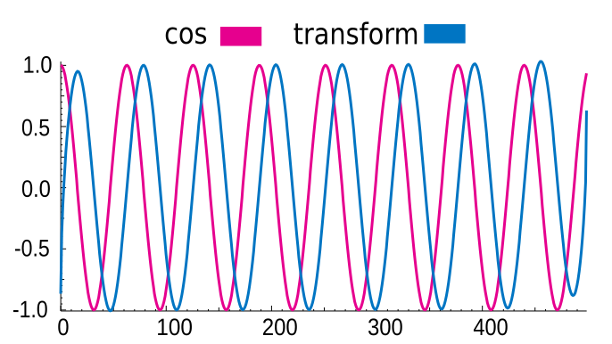

# hilbert_transform

[![NPM version][npm-image]][npm-url]
[![build status][ci-image]][ci-url]
[![Test coverage][codecov-image]][codecov-url]
[![npm download][download-image]][download-url]

transform.

## Installation

`$ npm i hilbert_transform`

## Usage

```js
import { hilbertTransform } from 'hilbert_transform';

const cos = new Array(5).fill(0).map((_, i) => Math.cos(i));
const result = hilbertTransform(cos);

// [0.015, 0.966, 1.058, 0.333, -0.367];
```

<p align="center">
  
</p>

## License

[MIT](./LICENSE)

[npm-image]: https://img.shields.io/npm/v/hilbert_transform.svg
[npm-url]: https://www.npmjs.com/package/hilbert_transform
[ci-image]: https://github.com/josoriom/hilbert_transform/workflows/Node.js%20CI/badge.svg?branch=main
[ci-url]: https://github.com/josoriom/hilbert_transform/actions?query=workflow%3A%22Node.js+CI%22
[codecov-image]: https://img.shields.io/codecov/c/github/josoriom/hilbert_transform.svg
[codecov-url]: https://codecov.io/gh/josoriom/hilbert_transform
[download-image]: https://img.shields.io/npm/dm/hilbert_transform.svg
[download-url]: https://www.npmjs.com/package/hilbert_transform
